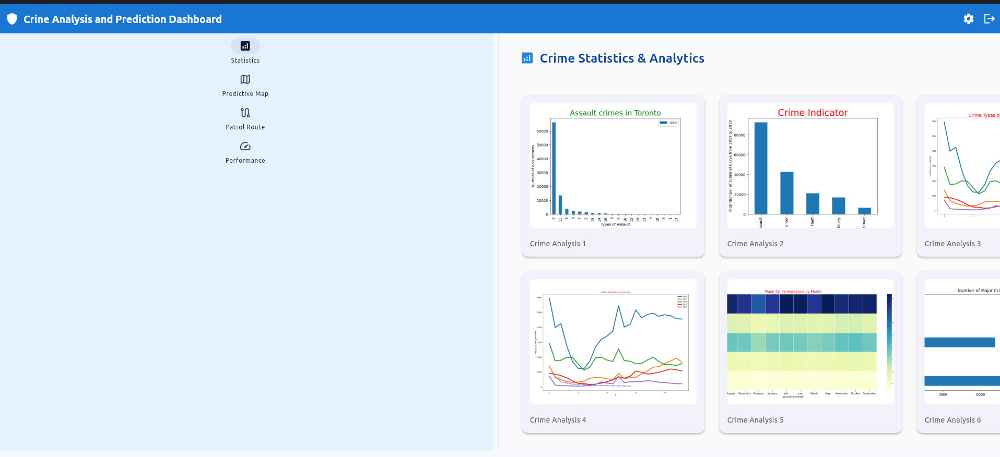
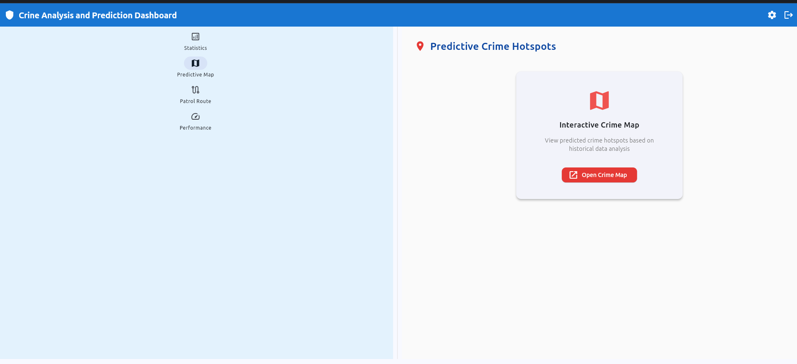

# Crime Analysis and Prediction System
CAPS is a unified system that leverages geospatial analysis and machine learning to visualize crime hotspots, predict future crime occurrences, and optimize police patrol routes, providing actionable insights to law enforcement for enhanced policing effectiveness.


## Key Features

- LCrime Hotspot Prediction: Visualize crime hotspots on a map using historical data.
- Crime Statistics: View crime statistics and visualizations.
- Performance Model: Analyze the performance of policing strategies.
- User Authentication: Secure login system with rate limiting.

## Tech Stack

- Python: Core programming language.
- Flet: For building the user interface.
- Folium: For creating interactive maps.
- Pandas: For data manipulation and analysis.
- Geopy: For geospatial calculations.
- Google Maps API: For fetching road data.

## Installation

- Clone the Repository

```bash
git clone https://github.com/Hyperterror/Crime_Analysis_Prediction_System.git
cd Crime_Analysis_Prediction_System
```

- Set Up Virtual Environment

```bash
python3 -m venv venv
source venv/bin/activate  # On Windows: venv\Scripts\activate

```

- Install Depedencies

```bash
pip install -r requirements.txt

```
## Usage

- Running Application:

```bash
python3 app.py

```

- Running on local port
```bash
flet app.py --web
```
## Features
- Login:
    
    a. Enter your username and password to access the dashboard.

- Dashboard:

    a. Statistics Tab: View crime statistics and visualizations.

    b. Predictive Map Tab: Visualize crime hotspots on a map.

    c. Patrol Route Tab: Generate optimized patrol routes.

    d. Performance Model Tab: Analyze policing performance.

- View Crime Map:

    a. Click "Show Crime Map" to view crime hotspots.
  




